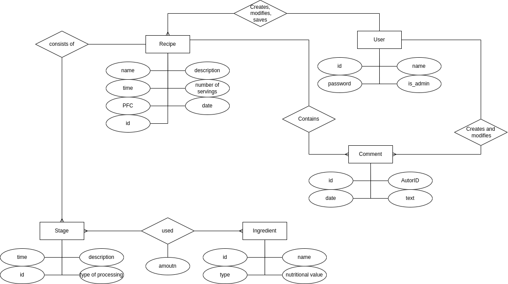
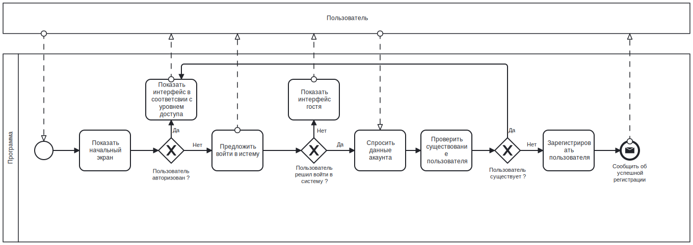
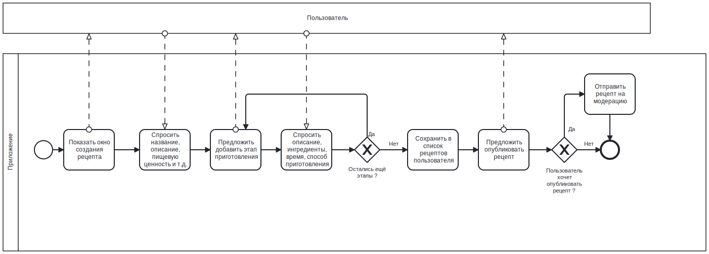
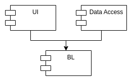
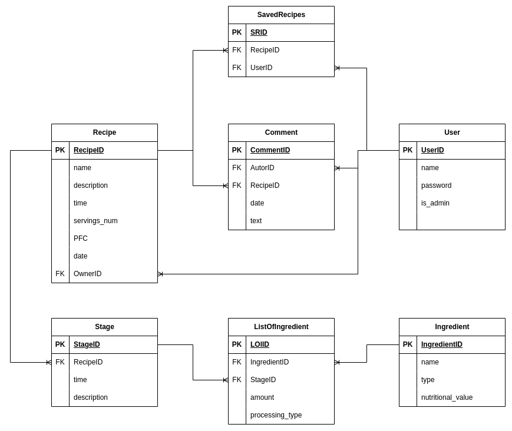

# Лабораторная работа 1

## 1. Название

Записная книжка для рецептов

## 2. Описание

Приложение позволяющее хранить список рецептов в их подробным описанием. Для каждого указывается
ингредиенты, время и этапы приготовлеия, количество порций. Для каждого этапа можно указать ингредиенты,
вид обработки: нерезка, варка, жарка и т.д., а также дополнительные пораметры, например, мощность
огня, время и т.д.
В приложении есть лента, которую можно просматривать и добавлятьв заклдки понравившиеся рецепты и коментировать.

## 3. Краткое описание предметной области

Предметной областью является кулинария, рецепты, приготовление блюд.

## 4. Краткий анализ аналогичных решений

| название        | избранные рецепты | коментарии | кастомные рецепты | модератор | встроеный таймер | список покупок |
|-----------------|-------------------|------------|-------------------|-----------|------------------|----------------|
| Kitchen Stories | +                 | -          | +                 | +         | -                | +              |
| RecipeBook      | +                 | -          | +                 | +         | +                | -              |
| Что готовим?    | -                 | -          | +                 | +         | -                | -              |
| Cookpad         | +                 | +          | +                 | +         | -                | -              |
| Моё решение     | +                 | +          | +                 | +         | +                | +              |

## 5. Краткое обоснование целесообразности и актуальности проекта

Есть множество приложений с рецептами, реализующих возможности социальных сетей. Но часто в них не хватает простых,
но удобных и полезных фич. Мое приложение объединит в себе эти решения. В этом состоит его уникальность/актуальность.

## 6. Use-Case - диаграмма

## 7. ER-диаграмма сущностей

## 8. Пользовательские сценарии

Неавторизированный пользователь может зайти в приложение просмотреть ленту с рецептами, зайти в
конкретный рецепт, просмотреть всю информацию по нему и этапы. Также может зарегестрироваться или войти
в настройках.

Авторизированный пользователь может выполнить все теже действия, что и неавторизированный пользователь.
Кроме этого после входа он может при просмотре рецепта сохранить его в закладки и написать коментрарий. Дополнительно
может на вкладке со своими рецептами добавить новый или просмотреть уже существующие. В настроках может выйти из аккаунта.

Авторизированный пользователь с правами администратора может просмотреть список рецептов ожидающих побликации. Также в
ленте может просмотреть любой рецепт, отредактировать или удалить его.

## 9. Формализация бизнес-правил

### Вход в приложение

### Добавление рецепта

---

# Лабораторная работа 2

## 1.Описание типа приложения и выбранного технологического стека

Тип - Mobile

Стек:
- back: Kotlin
- front: React Native/Kotlin Multiplatform Mobile
- БД: 

## 2. Верхнеуровневое разбиение на компоненты

## 3. UML диаграммы классов для двух отдельных компонентов

### Компонент доступа к данным

### Диаграмма сущностей БД

