# Лабораторная работа 1

## 1. Цель работы

Целью работы является - создание web приложения для хранения, просмотра и публикации рецептов. Оно позволить хранить рецепты в удобном формате. Также искать и делиться ими.

## 2. Функционал

1. Регистрация
1. Вход\выход
1. Просмотрт ленты рецептов
1. Просмотр рецепта
1. Добавить рецепт в избранное
1. Добавить коментарий
1. Добавить рецепт
1. Отредактировать рецепт
1. Опублиуовать рецепт
1. Одобрить\отклонить публикацию

## 3. Use-Case - диаграмма

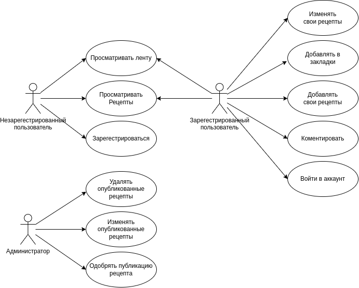

## 4. BPMN

### Вход в приложение

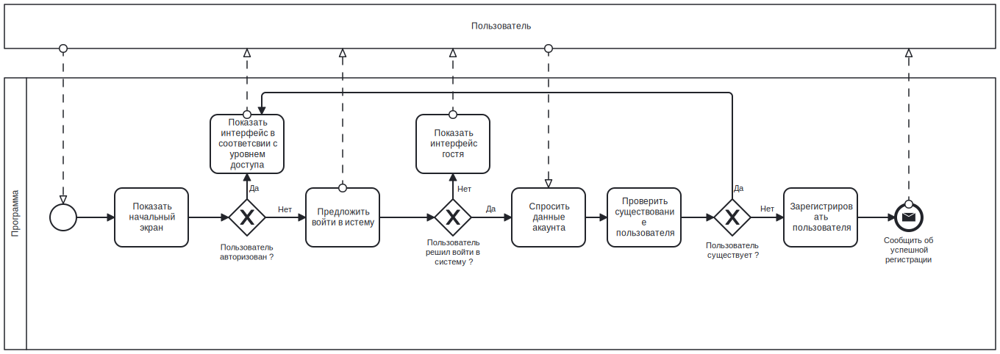

### Добавление рецепта

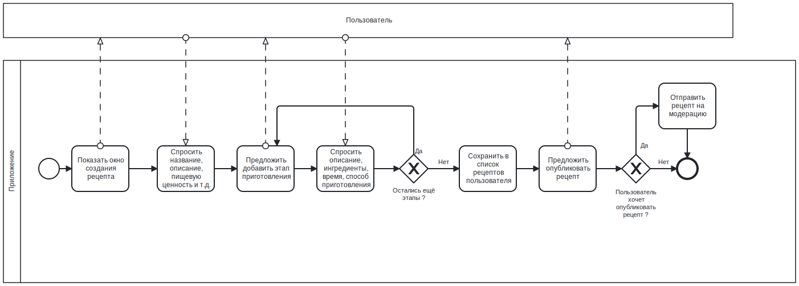

## 5. Основные пользовательские сценарии

Неавторизированный пользователь может зайти в приложение просмотреть ленту с рецептами, зайти в
конкретный рецепт, просмотреть всю информацию по нему и этапы. Также может зарегестрироваться или войти.

Авторизированный пользователь может выполнить все теже действия, что и неавторизированный пользователь.
Кроме этого после входа он может при просмотре рецепта сохранить его в закладки и написать коментрарий. Дополнительно
может на вкладке со своими рецептами добавить новый или просмотреть уже существующие. В окне просмотра собственного рецепта может отправить его на публикацию.

Авторизированный пользователь с правами администратора может просмотреть список рецептов ожидающих побликации и одобрить или отклонить их. Также в
ленте может просмотреть любой рецепт, отредактировать или удалить его.

## 6. ER-диаграмма сущностей

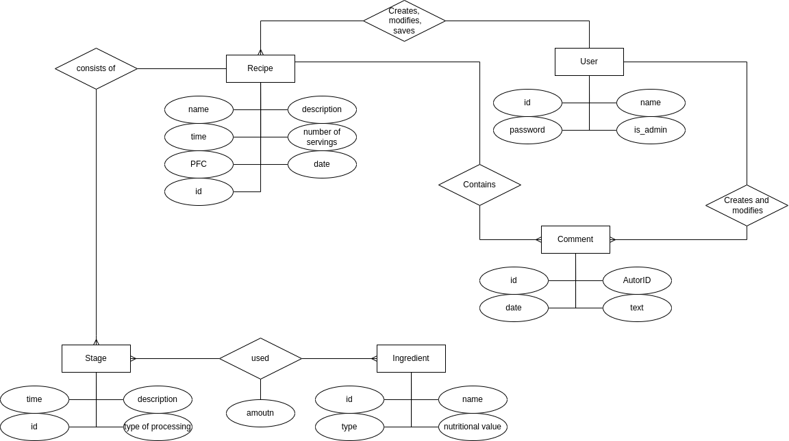

## 7. Диаграмма БД

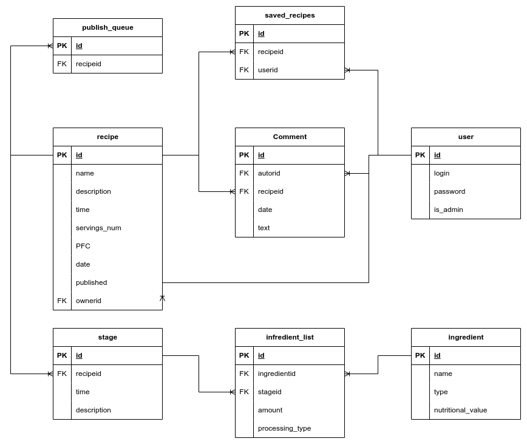

## 8. Компонентная диаграмма системы

## 9. Экраны будущего web-приложения

[Figma](https://www.figma.com/file/hftAGuGw9TOoDvvYFdvowX/BMSTU-WEB?type=design&node-id=0%3A1&mode=design&t=mHMGGWuZxwOvkou0-1)

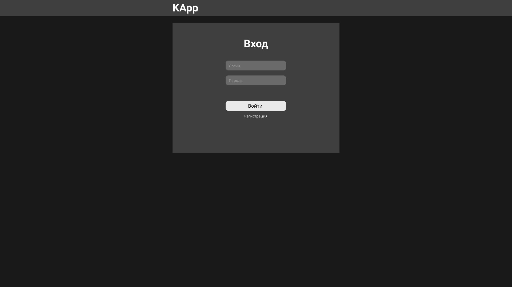
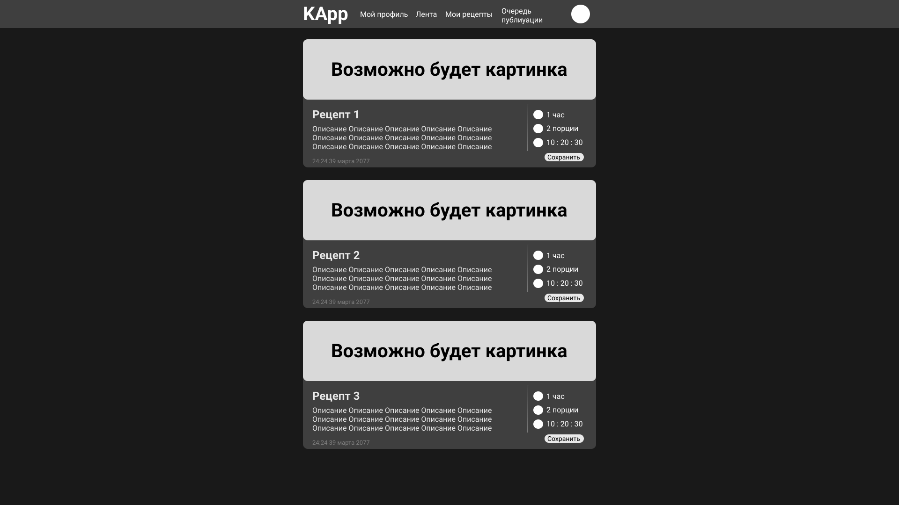
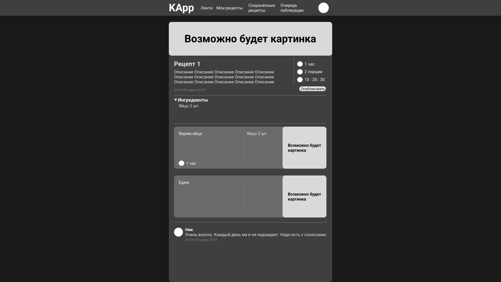
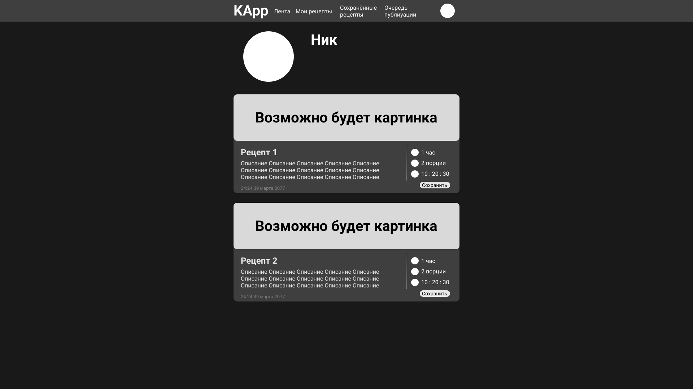
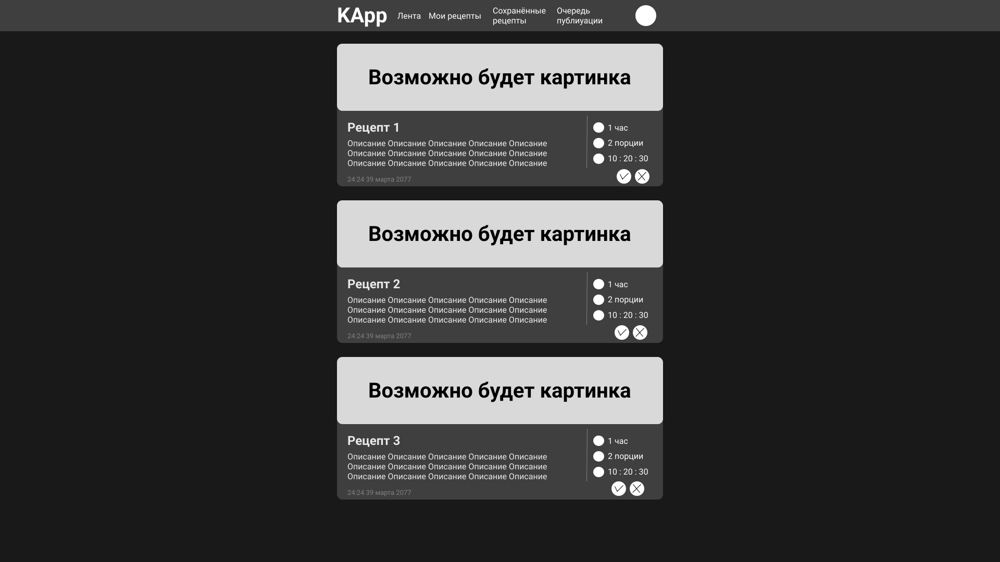
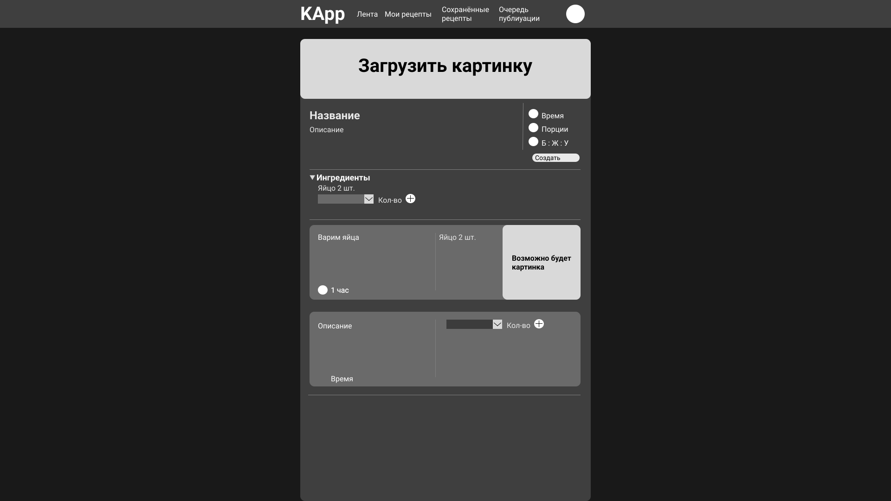
