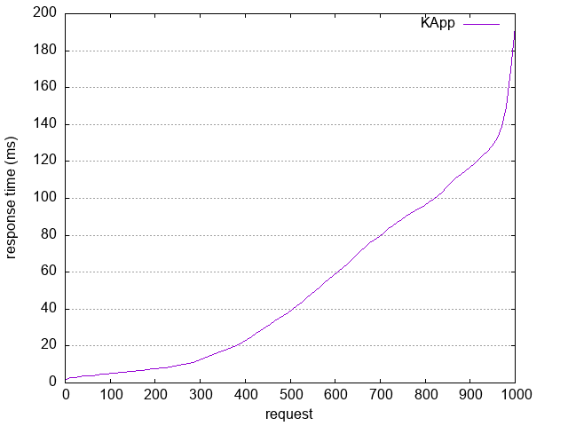
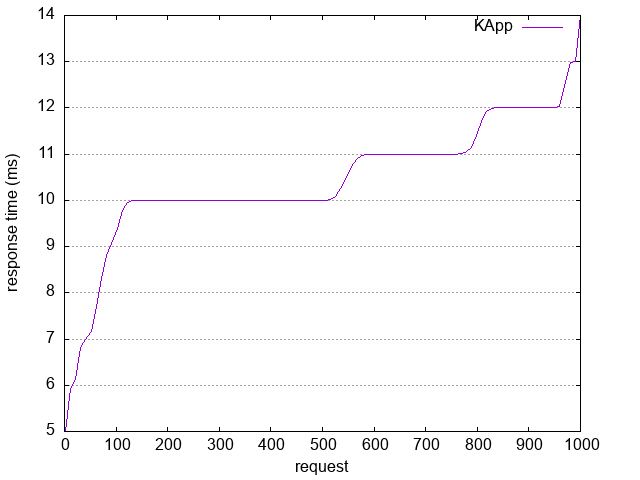
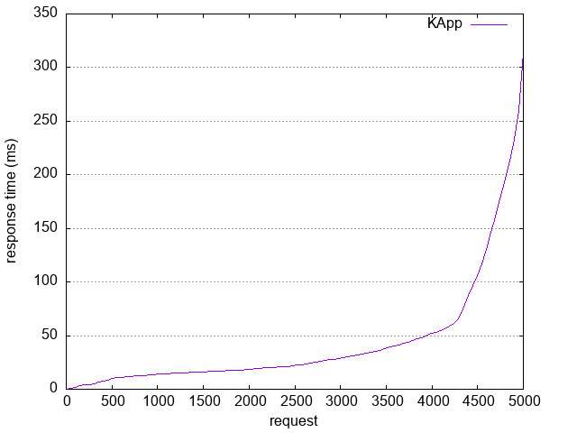
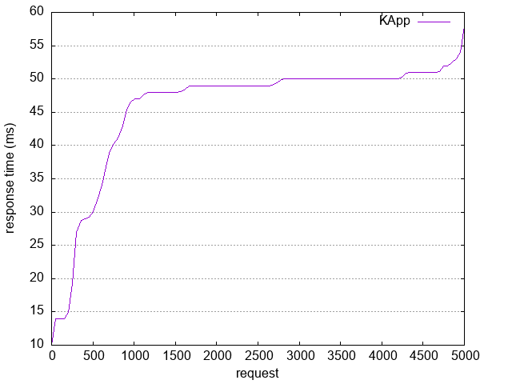
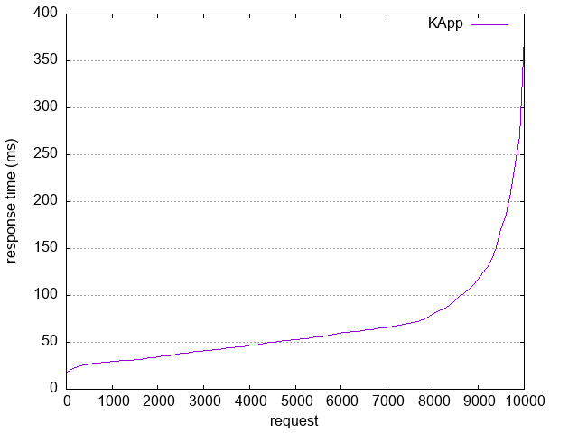
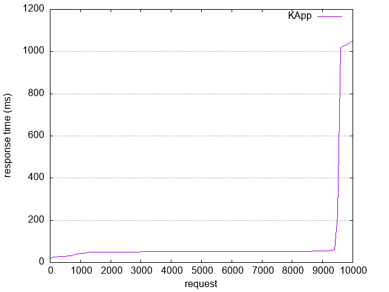
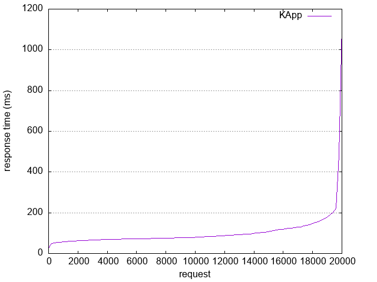
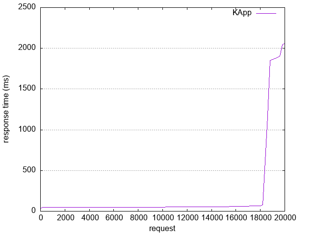

## Условия

Команда: ab -n 20000 -c 2000 -g out.data http://localhost:8888/api/v1/users

## Тест 1 (n=1000 c=100)

### С балансировкой

```
Server Software:        KApp
Server Hostname:        localhost
Server Port:            8888

Document Path:          /api/v1/users
Document Length:        209 bytes

Concurrency Level:      100
Time taken for tests:   0.546 seconds
Complete requests:      1000
Failed requests:        0
Total transferred:      351000 bytes
HTML transferred:       209000 bytes
Requests per second:    1831.14 [#/sec] (mean)
Time per request:       54.611 [ms] (mean)
Time per request:       0.546 [ms] (mean, across all concurrent requests)
Transfer rate:          627.67 [Kbytes/sec] received

Connection Times (ms)
              min  mean[+/-sd] median   max
Connect:        0    0   0.8      0       4
Processing:     2   52  45.1     38     193
Waiting:        2   52  45.1     38     193
Total:          2   52  45.0     38     193

```



### Без балансировки

```
Server Software:        KApp
Server Hostname:        localhost
Server Port:            8888

Document Path:          /api/v1/users
Document Length:        0 bytes

Concurrency Level:      100
Time taken for tests:   0.115 seconds
Complete requests:      1000
Failed requests:        0
Non-2xx responses:      1000
Total transferred:      115000 bytes
HTML transferred:       0 bytes
Requests per second:    8695.12 [#/sec] (mean)
Time per request:       11.501 [ms] (mean)
Time per request:       0.115 [ms] (mean, across all concurrent requests)
Transfer rate:          976.50 [Kbytes/sec] received

Connection Times (ms)
              min  mean[+/-sd] median   max
Connect:        0    0   0.9      0       4
Processing:     5   10   1.1     10      14
Waiting:        2   10   1.1     10      14
Total:          6   11   1.5     10      18
```



## Тест 2 (n=5000 c=500)

### С балансировкой

```
Server Software:        KApp
Server Hostname:        localhost
Server Port:            8888

Document Path:          /api/v1/users
Document Length:        209 bytes

Concurrency Level:      500
Time taken for tests:   0.490 seconds
Complete requests:      5000
Failed requests:        3928
   (Connect: 0, Receive: 0, Length: 3928, Exceptions: 0)
Total transferred:      376272 bytes
HTML transferred:       224048 bytes
Requests per second:    10209.31 [#/sec] (mean)
Time per request:       48.975 [ms] (mean)
Time per request:       0.098 [ms] (mean, across all concurrent requests)
Transfer rate:          750.29 [Kbytes/sec] received

Connection Times (ms)
              min  mean[+/-sd] median   max
Connect:        0    1   1.9      1       9
Processing:     0   41  53.3     21     314
Waiting:        0   25  58.7      0     314
Total:          0   43  53.3     22     314
```



### Без балансировки

```
Server Software:        KApp
Server Hostname:        localhost
Server Port:            8888

Document Path:          /api/v1/users
Document Length:        0 bytes

Concurrency Level:      500
Time taken for tests:   0.487 seconds
Complete requests:      5000
Failed requests:        0
Non-2xx responses:      4749
Total transferred:      546135 bytes
HTML transferred:       0 bytes
Requests per second:    10268.27 [#/sec] (mean)
Time per request:       48.694 [ms] (mean)
Time per request:       0.097 [ms] (mean, across all concurrent requests)
Transfer rate:          1095.29 [Kbytes/sec] received

Connection Times (ms)
              min  mean[+/-sd] median   max
Connect:        0    1   2.1      0      10
Processing:     4   45  11.2     49      58
Waiting:        0   45  12.5     49      58
Total:         10   46   9.3     49      58
```



## Тест 3 (n=10000 c=1000)

### С балансировкой

```
Server Software:        KApp
Server Hostname:        localhost
Server Port:            8888

Document Path:          /api/v1/users
Document Length:        209 bytes

Concurrency Level:      1000
Time taken for tests:   0.726 seconds
Complete requests:      10000
Failed requests:        8371
   (Connect: 0, Receive: 0, Length: 8371, Exceptions: 0)
Total transferred:      571779 bytes
HTML transferred:       340461 bytes
Requests per second:    13776.80 [#/sec] (mean)
Time per request:       72.586 [ms] (mean)
Time per request:       0.073 [ms] (mean, across all concurrent requests)
Transfer rate:          769.27 [Kbytes/sec] received

Connection Times (ms)
              min  mean[+/-sd] median   max
Connect:        0    4   4.6      1      18
Processing:     7   62  49.0     51     375
Waiting:        0   22  57.9      0     371
Total:         17   66  48.0     53     375

```



### Без балансировки

```
Server Software:        KApp
Server Hostname:        localhost
Server Port:            8888

Document Path:          /api/v1/users
Document Length:        0 bytes

Concurrency Level:      1000
Time taken for tests:   1.501 seconds
Complete requests:      10000
Failed requests:        0
Non-2xx responses:      9252
Total transferred:      1063980 bytes
HTML transferred:       0 bytes
Requests per second:    6663.87 [#/sec] (mean)
Time per request:       150.063 [ms] (mean)
Time per request:       0.150 [ms] (mean, across all concurrent requests)
Transfer rate:          692.40 [Kbytes/sec] received

Connection Times (ms)
              min  mean[+/-sd] median   max
Connect:        0    2   4.7      0      17
Processing:     8   95 210.0     51    1050
Waiting:        0   94 210.5     51    1050
Total:         17   97 210.5     51    1053
```



## Тест 4 (n=20000 c=2000)

### С балансировкой

```
Server Software:        KApp
Server Hostname:        localhost
Server Port:            8888

Document Path:          /api/v1/users
Document Length:        209 bytes

Concurrency Level:      2000
Time taken for tests:   1.917 seconds
Complete requests:      20000
Failed requests:        17049
   (Connect: 0, Receive: 0, Length: 17049, Exceptions: 0)
Total transferred:      1035801 bytes
HTML transferred:       616759 bytes
Requests per second:    10434.19 [#/sec] (mean)
Time per request:       191.677 [ms] (mean)
Time per request:       0.096 [ms] (mean, across all concurrent requests)
Transfer rate:          527.72 [Kbytes/sec] received

Connection Times (ms)
              min  mean[+/-sd] median   max
Connect:        0   19  11.9     19      47
Processing:    15   84 107.0     65    1109
Waiting:        0   27 113.4      0    1109
Total:         26  103 104.4     80    1116
```



### Без балансировки

```
Server Software:        KApp
Server Hostname:        localhost
Server Port:            8888

Document Path:          /api/v1/users
Document Length:        0 bytes

Concurrency Level:      2000
Time taken for tests:   2.622 seconds
Complete requests:      20000
Failed requests:        0
Non-2xx responses:      17343
Total transferred:      1994445 bytes
HTML transferred:       0 bytes
Requests per second:    7627.83 [#/sec] (mean)
Time per request:       262.198 [ms] (mean)
Time per request:       0.131 [ms] (mean, across all concurrent requests)
Transfer rate:          742.84 [Kbytes/sec] received

Connection Times (ms)
              min  mean[+/-sd] median   max
Connect:        0    7  11.9      0      43
Processing:    14  187 476.3     51    2054
Waiting:        0  182 477.8     51    2054
Total:         39  193 479.8     51    2064
```

